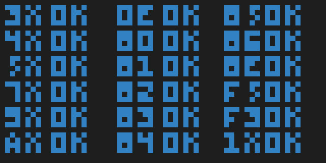

# CHIP-8 emulator

`rchip8` is a [CHIP-8](https://en.wikipedia.org/wiki/CHIP-8) emulator written in Rust.



## Building

To compile for release, just do:

```bash
cargo build --release
```

## Running

You can go ahead and run the executable created in the building step, which is under `target/release/rchip8`. Or you can just run using cargo, with optionally the `--release` target enabled:

```bash
cargo run --release -- [ROM_FILE]
```

## Display scaling

This implementation supports an integer display scaling factor, which makes the window larger by that factor. Use it with `-s [FACTOR]`.

## Debug

You can enable debug mode with `-d`. In this mode, the program halts before every instruction and prints the instruction itself, the decoded operation, the value of each register and the value of the index I.

## Speed

You can change the emulation speed in instructions per second with `-i [IPS]`. The default value is 1000.

### CLI arguments

Here are the available arguments:

```bash
R-CHIP-8 0.1.0
Toni Sagrsità Sellés <me@tonisagrista.com>
CHIP-8 emulator

USAGE:
    rchip8 [FLAGS] [OPTIONS] <input>

FLAGS:
    -d, --debug      Run in debug mode. Pauses after each instruction, prints info to stdout.
    -h, --help       Prints help information
    -V, --version    Prints version information

OPTIONS:
    -i, --ips <ips>        Emulation speed in instructions per second. Default value is 1000.
    -s, --scale <scale>    Integer display scaling, by default it is set to 15. If set to 1, the display is set to 64x32
                           pixels.

ARGS:
    <input>    ROM file to load and run.
```
